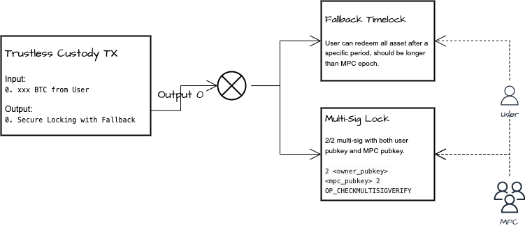
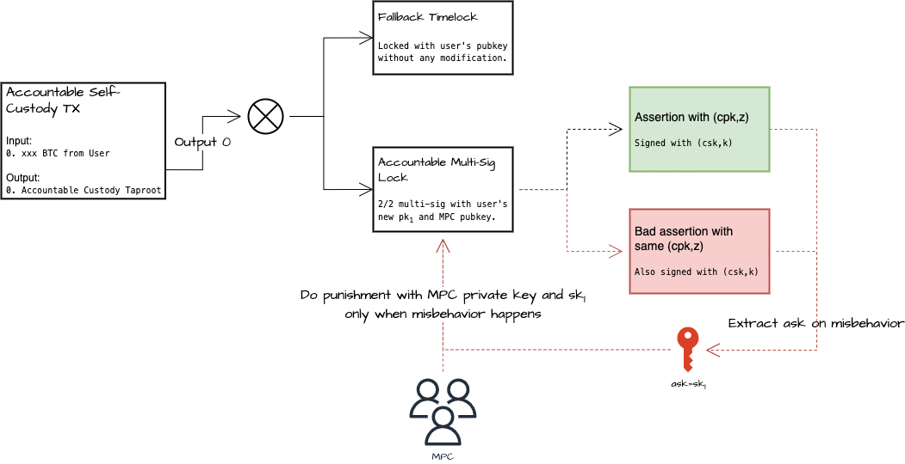
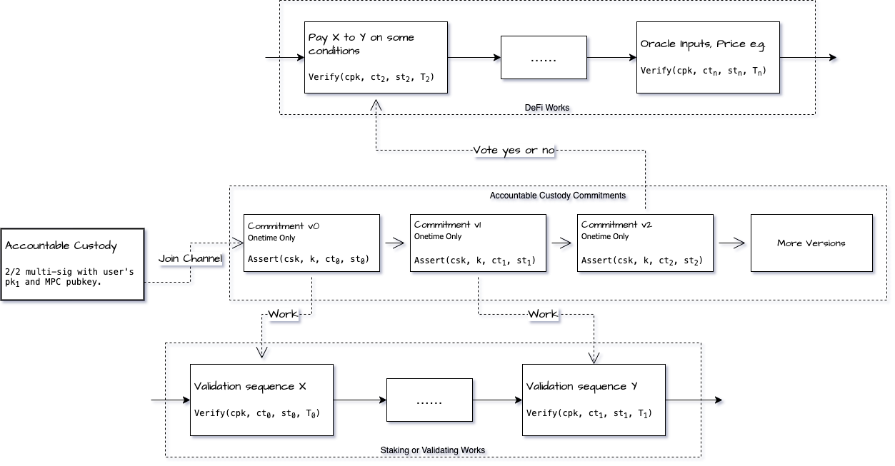
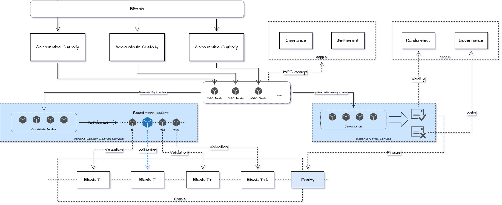
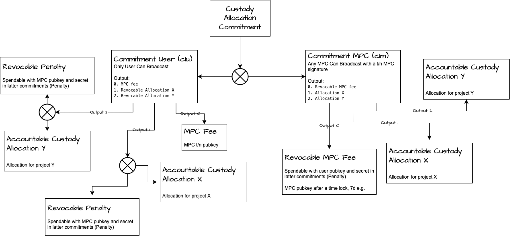
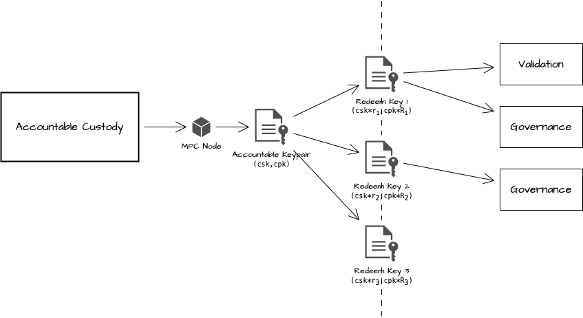
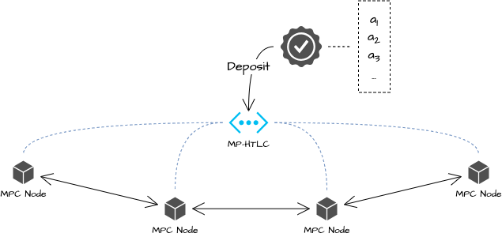
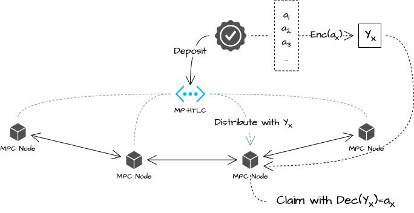

# Litepaper

## Abstract

In this paper, we introduce a unique framework for Self-Custody Consensus (SCC). We begin with the creation of trustless custody using cryptographic technologies such as Taproot and Multi-party computation (MPC) to bolster security. We then investigate the use of accountable assertions in trustless custody and introduce the concept of Accountable Trustless Custody. Subsequently, we discuss the implementation of a high-throughput channel, Accountable Custody Commitments, to enhance efficiency. Finally, we suggest a universal consensus layer, offering foundational support for various chains, Apps, and DApps.

Next, we present the Dynamic Custody Allocation Protocol. Its goal is to offer a flexible method for managing the use of custody. The protocol involves Custody Allocation Commitments and Profit Allocation Commitments. These utilize hash-locking and multi-party payment channel technology. This allows for quick allocation of managed assets and profits without sacrificing security.

Our research aims to enhance the security, efficiency, and functionality of Bitcoin custody and blockchain consensus, thereby promoting a more secure and efficient system.

## Background

As is well known, Bitcoin is Turing incomplete and slow, but $BTC has high consensus and great value. Based on the above facts, we use innovative technology to establish a new consensus on Bitcoin. Relink Millions of Bitcoin: Forging a New Consensus.

The loss of user asset control and limited application scenarios are the main obstacles for $BTC to enter applications. We proposed a new Bitcoin self-custody model that ensures $BTC remains under user control, while also ensuring the effective operation of applications on the Relinx consensus layer.

It is difficult for projects to gain $BTC trust, even though token funds, exchanges, etc. endorse these projects. Look at some data:

* $WBTC only accounts for 0.8% of the total circulation of BTC, and $BTCB accounts for 0.3% of the total circulation of $BTC
* 98% of $BTC is still in Bitcoin

Solutions that require users to give up asset control(such as cross-chain, and asset mapping) cannot leverage the huge value of $BTC.

The current blockchain projects can only implement limited application scenarios. They cannot bear the full value of $BTC.

* Transaction throughput, $BTC's 24-hour trading volume is $23B, but TPS is only 7. Obviously, both $BTC and other assets on Bitcoin rely more on off-chain or other trading methods
* Security, the Bitcoin network has been running for 15 years and has been proven to be reliable. Other chains are unlikely to be trusted by $BTC holders in a short period of time, so applications must be native to Bitcoin and are guaranteed by Bitcoin
* Scalability, the market value of $BTC = $1.35T, the total market value of Staking + DeFi = 187.9B + 44B = $231.9B, the market value of $BTC is 5.8 times the market value of Staking+DeFi. Applications such as Staking and DeFi cannot accommodate the huge value of $BTC, and more diverse application scenarios must appear

Objective data and the prospects of Bitcoin prompt us to adopt the latest technology to Improve and optimize the solution.

## SCC (Self-Custody Consensus) is Trustless

In this section, we explain how to construct a consensus layer above trustless self-custody using cryptographic technologies like Taproot, MPC, and accountable assertions \[1]. We then present a dynamic custody allocation protocol designed to support projects such as Layer 2 solutions and decentralized applications (dApps).

### Trustless Self-Custody Construction with Taproot

The aim of **Trustless Self-Custody** is to realize a brand new model of Bitcoin custody. In this model, the control of assets never leaves the user, but the user cannot arbitrarily terminate the custody. This thereby allows the user who provides Bitcoin for custody and the demand side for Bitcoin custody to not have to trust each other or any third party.

Technically, it is achieved by a taproot output with two script-paths, as shown in the figure below. One of the script-paths is a **Multi-Sig Lock** which is a 2/2 multi-signature, composed of the user's public key and the MPC's public key, and both parties must sign before it can be used. Neither party can use the output alone, thus fully ensuring the user's control. The other is the **Fallback Timelock**, which is controlled only by the user's public key. After the time expires, the user can sign it alone for use, which is only used as the final security guarantee when the entire network fails.

<figure><figcaption>
Trustless Self-Custody Construction with Taproot
</figcaption></figure>

The public key of MPC is a $$t/n$$ Schnorr multi-signature \[2], which consists of nodes participating in the network. Here, $$t$$ usually needs to be greater than $$n/2$$, and the choice of $$n$$ depends on the amount of custody required and the security strength required by the business scenario. Each node, while ensuring the safety of its own assets, also helps other nodes to protect their assets. The most direct use of this Multi-Sig Lock is to allow users to retrieve their assets in advance. When the MPC node verifies that the user's work has no issues, it can provide a signature for the user to retrieve the assets. When more than $$t$$ signatures are collected, the user can retrieve the assets. Of course, besides this use, there can be many flexible uses, and this feature is also used in the later text.

However, a significant challenge lies in eliminating the need to trust the MPC network. This challenge arises when contemplating how users can recover this taproot's script-paths if the entire MPC network ceases to function.

Two potential solutions exist. One is to store this information in IPFS, which is nearly cost-free, although not entirely without cost, but carries the risk of data loss. The other solution is to inscribe this information into the trustless self-custody transaction’s input. The input is initiated from the user's address, and the inscriptions are stored on the Bitcoin network. This ensures the user can always recover this taproot, eliminating the need to trust any third party, including the MPC network itself. The downside to this method is a minor inscription cost, but this cost is typically low and acceptable.

In summary, our approach to trustless self-custody aims to enhance trust by eliminating intermediaries and improving system safety. We employ strong cryptographic principles to bolster security. This focus on user-centric control, along with heightened security, enables smoother business operations. An additional safety measure is our user-controlled fallback timelock. Overall, our self-custody Bitcoin strategy provides an efficient, secure system backed by a robust fallback plan.

### Accountable Self-Custody

After the implementation of trustless self-custody, we need to consider building security guarantees for the demand side on this basis, that is, to increase the ability to prevent evil and resist attacks without losing the security of trustless self-custody. This can be achieved by combining accountable assertions and trustless self-custody over taproot, which we call **Accountable Self-Custody**.

The cryptographic technology of accountable assertions retains the possibility of being held accountable for malicious actions (such as double-spending or double-voting, etc.) when the user performs various operations, which are implemented based on chameleon hash functions \[3]. Specifically, let’s construct a tree space with a height of $$\ell$$ and an outdegree of n and a key pair of the chameleon hash function $$(cpk,csk)$$, then select a random number $$k$$, use the pseudorandom function $$F_k$$ to construct the root node and calculate its hash value $$z$$, then the public key is $$(cpk,z)$$. Then use $$csk$$ to generate a series of node values and random number sequences from leaf to root for the data that needs to be signed, and this output is the assertion $$\tau$$. The verification process is to parse the assertion $$\tau$$ and reconstruct the nodes, calculate the hash value of the root node, and verify whether it is consistent with $$z$$. A more important feature of this algorithm is that it can extract the key $$csk$$ when signing more than once. The specific method is when there are two different assertions $$(\tau_0, \tau_1)$$ found with the same public key, people can calculate these two assertion paths like the verification process, until finding a position in the tree, and the two assertion paths form a collision in the chameleon hash function, then use the extraction algorithm of chameleon hash to output the secret key $$ask=csk.$$

As shown in the figure below, the process of adding accountable assertions to trustless self-custody can be realized as follows. The user generates a new key pair $$(pk_1,sk_1)$$ and completes the 2/2 multi-signature lock with $$pk_1$$. Use $$csk=sk_1$$ and a random number k to generate the public key $$(cpk,z)$$ to do accountable assertions, which can be used for voting or signing operations in business scenarios but can only be used once. According to the previous explanation of the accountable assertions, when the user does nothing evil, $$sk_1$$ will never be exposed, and the control is always in the hands of the user, so it will not reduce the user's control at all. But when the user does evil, $$sk_1$$ will be exposed, MPC can then gain control of the assets and then execute the punishment, thereby suppressing the motive of malicious participants to attack.

<figure><figcaption>
Accountable Self-Custody
</figcaption></figure>

### Accountable Custody Commitments

**Accountable Custody Commitments** is the combination of a high throughput channel and the aforementioned Accountable Self-Custody TX. This is because accountable assertion can only be used once, if we don't make any improvements, a new Accountable Self-Custody TX must be created after being consumed, which will obviously affect efficiency.

Thanks to the complete input of an assertion $$\tau$$ being $$(csk,k,ct,st)$$, and the input to extract $$csk$$ is $$(cpk,ct,st_0,st_1,\tau_0,\tau_1)$$, that is, only when $$ct$$ is same and $$st$$ is different can $$csk$$ be extracted. Therefore, we only need to constantly change the context $$ct$$, then even the same $$st$$ cannot extract $$csk$$. We can take advantage of this feature to establish a high throughput assertions channel as shown in the figure below, namely Accountable Custody Commitments.

<figure><figcaption>
Accountable Custody Commitments
</figcaption></figure>

The primary advantage of this high-throughput channel is that it eliminates the need for on-chain confirmation. Additionally, it is cryptographically secure, ensuring commitments cannot be forged. Furthermore, it inherits the feature of accountable assertions to prevent evil deeds. This also greatly enhances the efficiency and security of our system, allowing for the implementation of advanced functionalities. Voting and Proof of Stake (PoS) validation serve as prime examples of these functionalities.

In a standalone context, voting, facilitated by Accountable Custody Commitments, provides a fast, secure channel for users to participate in network governance. Votes on protocol upgrades or other network matters are processed quickly and securely through the high-speed assertions channel.

Within the PoS consensus mechanism, both voting and validation play crucial roles in securing the network. Users demonstrate ownership of a certain number of tokens to generate a new block or validate transactions. In this context, voting is used to achieve finalization, reaching a definitive state through global voting, and ensuring that validated transactions cannot be reversed.

Validation in PoS, another key functionality, is essentially an assertion of truth regarding the state of the network. Validators, who are selected based on their stake, are required to agree on the state of the network. This agreement is a form of assertion that is crucial for the functioning of the PoS consensus mechanism. Accountable Custody Commitments provide a fast and secure channel for these assertions, further enhancing the security and efficiency of the network.

With Accountable Custody Commitments, we can provide a fast and secure channel for both voting and validation scenarios in the PoS consensus mechanism. This not only enhances the democratic nature of our system but also encourages user participation in network governance, ultimately leading to a more secure and efficient system.

In conclusion, the incorporation of Accountable Custody Commitments into our system not only boosts efficiency and security but also enables the effective implementation of advanced functionalities like voting and validation in PoS. This development broadens the overall utility of our system and strengthens its appeal to users.

### Universal Consensus Layer

A universal consensus layer is not a new chain. Instead, it is a decentralized network similar to the MPC network or the Lightning Network \[4]. It is a brand new consensus layer built on this network, which can be constructed with Accountable Custody Commitments.

Blockchain consensus essentially ensures the final consistency of a decentralized state, which usually refers to state machine replication \[5]. In simpler terms, consider a set $$S$$ which includes all possible decentralized states. Each state $$s$$ can be represented as $$s \in S$$. The state can change via any operation, and these possible operations form the set $$C$$. Each operation $$c$$ can be represented as $$c \in C$$. The state transition function is defined as $$\delta: S \times C \rightarrow S$$. Each node $$i$$ in the decentralized network maintains an operation log $$Log_i$$, which is a sequence of operations $$Log_i = [c_1, c_2, ..., c_m]$$. The consistency condition is $$\forall i, j \in Nodes, \exists k: Log_i[k] = Log_j[k]$$. At present, the consensus guarantees this final consistency. If we abstract various consensus algorithms, it is the completion of the election of $$Leader$$. $$Leader$$ publishes his $$Log_{l}[k]$$, and other nodes then carries out a correctness check. At this point, different consensus algorithms will employ different Byzantine fault tolerance methods. After completing fault tolerance, the entire decentralized network transitions to the next state. The consensus algorithm ensures the final consistency of this state transition.

Accountable custody commitments can be utilized in $$Leader$$ elections and Byzantine fault tolerance. Let's take $$Leader$$ election as an example. A common method is to list a series of candidate nodes \[6], which are supported by computing power or staking to prevent arbitrary attacks. Accountable custody commitment can serve as the candidate threshold and endorsement. Following this, the BLS algorithm can be used for random elections \[6], and regular block production or computation processes can be implemented.

In Byzantine fault tolerance, the accountable custody commitment can act as the final consistency vote. This approach has been used in Ripple \[7], Stellar \[8], BitShares \[9], and ETH2 \[6].

Therefore, we can design this universal consensus layer in the following way.

<figure><figcaption>
Universal Consensus Layer
</figcaption></figure>

The universal consensus layer is a versatile blockchain tool that supports diverse functions. Some examples include supporting Layer2 and decentralized projects, helping in clearance and settlement execution, verifying random numbers in systems that rely on randomization, and facilitating democratic governance voting in various projects. These functions make it a valuable addition to the blockchain technology landscape.

## Dynamic Allocation of Self-Custody

In this section, our goal is to offer a flexible approach to managing custody utilization. Given the diverse strategies or preferences across different projects, some users might prefer committing their assets to data validation and infrequently adjusting their portfolios. Conversely, others might want to swiftly modify their portfolio based on project performance. We strive to offer an efficient dynamic allocation protocol for managed assets to handle various known or unknown usage scenarios.

### Custody Allocation Commitments

Custody Allocation Commitments represent an innovative approach, leveraging the power of hash-locking technology as shown in the figure below. This technology is critical in facilitating the rapid allocation of assets held in custody. The unique advantage of this approach lies in its ability to speed up the asset allocation process without compromising the security of those assets. This ensures that the assets remain protected even as they are swiftly allocated, providing a crucial balance between efficiency and security in the management of custodial assets.

<figure><figcaption>
Custody Allocation Commitments
</figcaption></figure>

In this model, the user has the ability to rapidly allocate their custody assets. The MPC plays the role of a counterparty, assisting in the establishment of Hash Time-Locked Contracts (HTLC) \[4]. In return for this service, the MPC might impose a certain protocol fee. The entire process bears a striking resemblance to the payment channel of the Lightning Network, a system designed to enable swift and secure micro-transactions between parties.

However, there is a fundamental difference between the two. While the Lightning Network consistently adjusts the balance between two interacting parties, Custody Allocation Commitments function by allocating custody funds between different projects. This distinction allows for a more flexible and dynamic allocation of funds, tailored to the user's preferences and investment strategies.

Despite this dynamic allocation, the control of these funds never leaves the user's hands. They retain full control over their assets, ensuring that their funds are secure and under their direct supervision. Moreover, the entire process is fortified by cryptography, adding an additional layer of security. This not only safeguards the user's assets but also makes the process highly efficient.

This blend of efficiency and security makes Custody Allocation Commitments an optimal solution for users seeking a flexible, yet secure, allocation of their custody assets. This model, therefore, serves as a key component in the broader landscape of secure asset management and allocation.

### Profit Allocation Commitments

The process of distributing revenue in the protocol is highly fragmented and ever-evolving. Implementing this in traditional EVM contracts is somewhat straightforward. Typically, each time an operation is performed, a global value is used to calculate the profits for all parties, and distribution is done based on this. The challenge for our protocol comes in protecting the distribution results. One feasible approach is to continue referencing the $$(csk,cpk)$$ from Accountable Self-Custody as proof of equity claim. However, to prevent the leakage of $$csk$$, we can carry out a Schnorr transformation \[10] $$sk_e=cskr,pk_e=cpkR$$. This not only verifies ownership but also avoids exposing $$csk$$. For additional protection of the private key, a distinct random number $$r$$ can be used each time, ensuring that each $$(sk_e,pk_e)$$ is unique, while still verifying ownership. A simplified illustration of this is shown below:

<figure><figcaption>
Profit Allocation Commitments -1
</figcaption></figure>

But on the native network of Bitcoin, there is no such Turing-complete virtual machine to provide this capability, which makes things complicated. In order to ensure the safety of participants' benefits without losing flexibility, we introduced Profit Allocation Commitments to achieve rapid profit distribution and confirmation. The construction of the entire Profit Allocation Commitments requires the following steps.

First, we need to construct a multi-party HTLC network \[11] for profit distribution as shown in the figure below. Each node in the network needs to establish at least one direct or indirect status channel with another node.

<figure><figcaption>
Profit Allocation Commitments -2
</figcaption></figure>

The profits go directly into this multi-party state channel and are continuously paid to each participant with an oblivious transfer schema \[12]. The specific process is that when the profits enter this multi-part network, a group of random secrets $$(α_i, i\in{0, ..., n})$$ is created.

<figure><figcaption>
Profit Allocation Commitments -3
</figcaption></figure>

When profits are distributed to one of the nodes X, its $$cpk$$ is extracted from the work completed by X (mainly from Accountable Assertion), and $$Y_x$$ is obtained after encrypting $$a_x$$ with $$cpk$$. $$Y_x$$ is sent to X, and a distribution transaction is sent to the network at the same time, extracting the public key as $$Y_x$$. At this point, only X can obtain the extraction key by decrypting it with its private key.

<figure><figcaption>
Profit Allocation Commitments -4
</figcaption></figure>

## Conclusion

We believe these technologies together can greatly enhance the efficiency, security, and versatility of blockchain networks. Collectively, these advancements leverage cutting-edge technology to address the challenges of modern blockchain networks, paving the way for a more secure, efficient, and democratic blockchain network.

## References

* Ruffing, Tim, Aniket Kate, and Dominique Schröder. "Liar, liar, coins on fire! Penalizing equivocation by loss of bitcoins." _Proceedings of the 22nd ACM SIGSAC Conference on Computer and Communications Security_. 2015.
* Nick, Jonas, Tim Ruffing, and Yannick Seurin. "MuSig2: Simple two-round Schnorr multi-signatures." _Annual International Cryptology Conference_. Cham: Springer International Publishing, 2021.
* Krawczyk, Hugo, and Tal Rabin. "Chameleon hashing and signatures." _Cryptology ePrint Archive_ (1998).
* Poon, Joseph, and Thaddeus Dryja. "The bitcoin lightning network: Scalable off-chain instant payments." (2016): 1-59.
* Bessani, Alysson, João Sousa, and Eduardo EP Alchieri. "State machine replication for the masses with BFT-SMART." _2014 44th Annual IEEE/IFIP International Conference on Dependable Systems and Networks_. IEEE, 2014.
* Buterin, Vitalik, and Virgil Griffith. "Casper the friendly finality gadget." _arXiv preprint arXiv:1710.09437_ (2017).
* Schwartz, David, Noah Youngs, and Arthur Britto. "The ripple protocol consensus algorithm." _Ripple Labs Inc White Paper_ 5.8 (2014): 151.
* Mazieres, David. "The stellar consensus protocol: A federated model for internet-level consensus." _Stellar Development Foundation_ 32 (2015): 1-45.
* Schuh, Fabian, and Daniel Larimer. "Bitshares 2.0: general overview." _accessed June-2017.\[Online]. Available: http://docs. bitshares. org/downloads/bitshares-general. pdf_ (2017).
* Schnorr, Claus-Peter. "Efficient signature generation by smart cards." _Journal of cryptology_ 4 (1991): 161-174.
* Dziembowski, Stefan, Sebastian Faust, and Kristina Hostáková. "General state channel networks." _Proceedings of the 2018 ACM SIGSAC Conference on Computer and Communications Security_. 2018.
* Kolesnikov, Vladimir, and Ranjit Kumaresan. "Improved OT extension for transferring short secrets." _Advances in Cryptology–CRYPTO 2013: 33rd Annual Cryptology Conference, Santa Barbara, CA, USA, August 18-22, 2013. Proceedings, Part II_. Springer Berlin Heidelberg, 2013.
