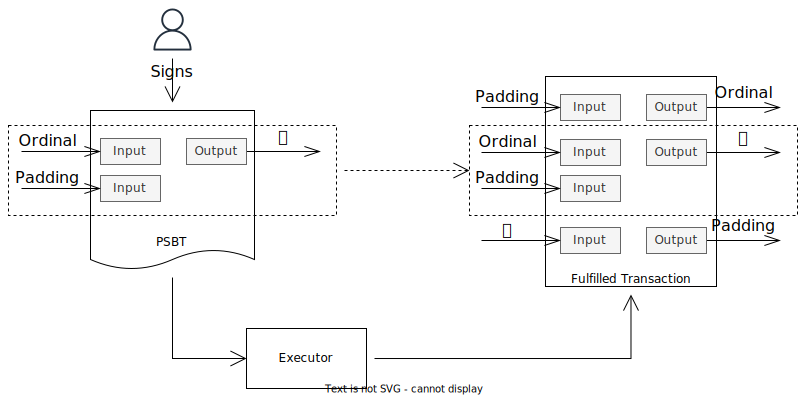
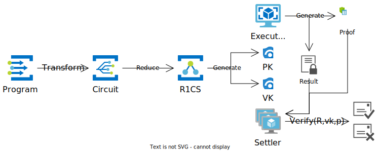

# MPC based UCL(Universal Consensus Layer)

## Background

### Consensus is not Computation

Consensus is a fundamental concept in distributed systems, including but not limited to blockchain technology. It refers to the process of reaching agreement among multiple entities or nodes on a specific decision, action, or state of data. In blockchain networks, consensus mechanisms serve as fault-tolerant systems for transaction verification and maintaining agreement on the current network state[1,2,3].

These mechanisms ensure that all nodes in the network concur on the authenticity of transactions and the overall state of the system. By implementing consensus protocols, blockchains can preserve consistency and reliability across distributed networks, even in scenarios where multiple processes or nodes need to maintain a common state of data.

Consensus mechanisms, regardless of their specific algorithm, primarily focus on maintaining and agreeing upon the system's state[4]. This process is more closely related to data storage and synchronization than complex computational tasks. The main goal is to ensure all network nodes have a consistent view of the current state, including transaction history and account balances. While this state management is crucial for blockchain integrity, it doesn't inherently involve executing complex computations or processing data.

### MPC is not Consensus

Multi-Party Computation (MPC) has gained significant attention in recent years, particularly due to its applications in MPC wallets and Threshold Signature Schemes (TSS) for multi-signing. While Verifiable Random Functions (VRF), especially it’s implementation with BLS (Boneh-Lynn-Shacham), are widely utilized in Proof-of-Stake (PoS) blockchain networks [5,6], it's important to note that VRF is merely one component within the broader consensus mechanism and plays a relatively minor role in the overall process.

It's crucial to understand that MPC encompasses a much broader range of computational technologies than just TSS and VRF. In essence, MPC refers to a comprehensive secure multi-party computing framework designed to maintain accuracy, ensure security, and protect privacy in distributed computations [7]. This framework extends far beyond the specific applications of TSS and VRF, offering a wealth of possibilities for secure, collaborative computation across multiple parties.

In fact, MPC has the potential to play a far more significant role when integrated with consensus mechanisms. By leveraging the power of MPC, it becomes possible to introduce substantially more complex computational capabilities into blockchain networks [8,9]. This integration could potentially address some of the computational limitations inherent in current blockchain architectures, opening up new avenues for sophisticated on-chain computations while maintaining the decentralized and secure nature of the network.

### Smart Contracts are not Scalable

Although smart contracts provide blockchain networks with computational capabilities, these are inherently limited in scope and complexity [10,11,12,13]. This limitation stems from several factors intrinsic to blockchain architecture. Firstly, the code size of smart contracts is typically restricted to ensure efficient verification and execution across the network. Secondly, the concept of 'gas' in many blockchain systems, which represents the computational cost of executing operations, places a practical ceiling on the complexity of computations that can be performed. Lastly, the transactions per second (TPS) rate of most blockchain networks constrains the volume and frequency of computations that can be processed in real-time.

Several scaling methods aim to address this issue [24], but they primarily tackle the TPS challenge, leaving the code size and execution cost limitations intact. Consequently, while smart contracts enable some on-chain computation, they remain confined to relatively simple operations and can't match the computational power of traditional centralized systems for complex tasks.

## Goals of UCL

### Computing with Finalization

Finalization of computation refers to the process of establishing a definitive proof of correct execution. This concept encompasses three crucial aspects: correctness, verifiability, and immutability of the computational result. In essence, it ensures that the outcome of a computation is not only accurate but also independently verifiable and unchangeable once established.

Smart contract platforms can achieve finalization by leveraging blockchain technology. Once a computation is executed and recorded on the blockchain, it becomes part of an immutable ledger, thus finalizing the result. However, the verification process in these platforms often involves replaying the entire computation on all nodes in the network. While this approach ensures thorough verification, it sacrifices efficiency, especially for complex or resource-intensive computations. This trade-off between finalization and efficiency presents a significant challenge in the realm of decentralized computation.

On the other hand, Multi-Party Computation (MPC) excels in achieving correctness and verifiability with high efficiency. It allows multiple parties to jointly compute a function over their inputs while keeping those inputs private, ensuring the accuracy of the result. Moreover, MPC protocols typically incorporate mechanisms for participants to verify the correctness of the computation[14,15]. However, MPC systems generally lack inherent finalization capabilities, as they don't provide a mechanism to make the result immutable or universally accepted.

### Generic Decentralized Computation

Turing-completeness is frequently employed to define the generality of computation. This concept was introduced to blockchain technology with the launch of Ethereum and has since been established as a fundamental requirement for smart contract platforms [16,17]. However, it's important to note that this represents only a form of generic computation, as it is executed on a single computer and subsequently verified by the entire network.

In contrast, a truly generic decentralized computation bears similarities to parallel computation, but with crucial distinctions. Parallel computation, a field that has been extensively researched for decades [18,19], allows for the simultaneous execution of multiple computational tasks. However, traditional parallel systems, while potentially resilient against single points of failure, may not be inherently decentralized or resistant to compromise.

To address these limitations, we can conceptualize generic decentralized computation as a fusion of parallel computation with Byzantine Fault Tolerance (BFT). This combination allows for distributed computational tasks to be executed across multiple nodes while maintaining consensus and security even in the presence of potentially malicious actors. By incorporating BFT mechanisms, such a system can ensure not only the efficiency gains of parallel processing but also the robustness and trustworthiness required for decentralized applications.

In essence, generic decentralized computation extends beyond the capabilities of both traditional smart contracts and conventional parallel systems. It is a framework for executing complex, distributed computational tasks with the added assurances of decentralization, fault tolerance, and resistance to compromise. This approach has the potential to significantly expand the scope and scale of blockchain-based applications, enabling more sophisticated and resource-intensive computations while preserving the core principles of decentralization and security.

### Accuracy, Efficiency and Scalability

In the context of UCL (Universal Consensus Layer), the simultaneous achievement of accuracy, efficiency, and scalability represents a crucial and multifaceted objective.

Accuracy, the cornerstone of reliable computation, ensures that all operations are executed with precision and yield dependable results. This concept extends beyond mere correctness; it encompasses the system's resilience against potential misbehavior or malicious actions within a decentralized environment. Such robustness is paramount in maintaining the integrity of the network and the trustworthiness of its outputs.

Efficiency, another key objective, is intrinsically linked to the performance demands of modern internet services [20]. In this context, efficiency can be conceptualized as the system's ability to minimize latency, a metric that has long been a significant challenge for blockchain technologies [21]. The pursuit of low latency isn't merely about speed; it's about creating a responsive and agile network capable of handling real-time transactions and computations.

Scalability, the third key goal, emphasizes the system's adaptability and extensibility. It enables seamless support for both small-scale operations and large, complex applications [22,23]. This scalability spans from simple point-based systems to intricate, data-intensive applications like search engines, another significant challenge for current decentralized applications.

## Fundamentals of UCL

### Native Executor

A native executor executes code using native Bitcoin transactions, where execution is triggered by UTXO inputs and settled with UTXO outputs. To achieve this, we can employ two different schemes for different situations: one for quick settlement and another for faster finalization.

For quick settlement, we use signed Partially Signed Bitcoin Transactions (PSBTs). Desired inputs and outputs are signed beforehand. In this scenario, the code is pre-run and minimal outputs are signed to avoid losses. Our executor then runs the code, checks if minimal outputs match, and fills and signs the missing part of the transaction according to the execution result. This approach is ideal for quick settlement as the execution result is immediately broadcast to the Bitcoin network.

Assets such as ordinals or inscriptions cannot be guaranteed as outputs in this case. However, a simple modification can provide a workaround. The user creates a PSBT without a signature, then the executor fills in the missing part with the desired ordinal as input. Finally, the user signs the completed transaction. This approach will effectively address the issue.

<figure><figcaption>
PSBT Sample
</figcaption></figure>

For faster finalization, Hash Time Locked Contract (HTLC) commitments can be employed. This method is similar to the previous one but uses HTLC commitments instead of signed transactions as the result. In this approach, commitment secrets are constructed before execution. The user signs a PSBT to trigger code execution. An executor version of the commitment can be constructed and signed at any time when someone wants to broadcast it, though they must pay the transaction fee. Meanwhile, a user version of the commitment is constructed and partially signed by the executor as the execution result.

To protect against misbehavior, our executor rejects signing requests from other users within a set period but allows signing from anyone after this period to prevent asset locking. To avoid transaction stalling, Replace-By-Fee (RBF) is enabled, allowing anyone to speed up the process.

<figure><figcaption>
HTLC Sample
</figcaption></figure>

A signed PSBT is used in this executor version to ensure validity, while a modified PSBT constructs the user version of the commitment. This approach safeguards the user version, as only the user can sign and broadcast it. The executor partially signs this version, enabling the user to complete the signature and broadcast it when necessary. The following figure illustrates this process.

Both these schemes aim to ensure efficient asset utilization for execution while keeping user assets under control if execution fails.

### Parallel Executor

The parallel executor comprises two logical roles: executor and settler. These are not physical entities; in other words, these roles can operate within the same node. This architecture enables parallel execution by distributing execution requests to different executors, with only a single or a few executors needing to run code. Settlers are also divided into separate subsets to facilitate parallel settlement of execution results.

The general diagram is shown below. More details are provided in the following two sections.

<figure></figure>

#### Executor

Executors run code triggered by signed PSBTs or HTLC commitments. After execution, the system creates fulfilled Bitcoin transactions or HTLC commitments, which are published and await signing. A zkSNARK proof is generated post-execution to verify integrity and correctness, enabling quick validation of the execution result.

Executors can be either a running node or even the user themselves. A fee can be deducted by the executor to cover execution costs and incentivize participation.

#### Settler

Settlers play a crucial role in the system by validating execution results and signing fulfilled transactions or commitments. This validation process is carried out through a threshold signing mechanism, which ensures that multiple parties must agree on the validity of a result before it is accepted. To further enhance security and decentralization, all Settlers are underpinned by self-custody consensus (SCC) and will be explored in subsequent sections of this document.

Settlers receive incentives in the form of settling rewards, promoting active engagement in SCC and bolstering the system's overall stability and security.

### Proof of Correct Execution

As detailed in the executor section, all execution results are accompanied by a zkSNARK proof, a cryptographic method that has been demonstrated to be both practical and efficient in various applications [25,26]. However, while zkSNARK proofs provide a robust foundation for verifying computational integrity, they alone are insufficient to fully construct the Self-Custody Consensus (SCC) system we envision.

To address this, we introduce the core concept of SCC: Proof of Correct Execution (PoCE). This innovative approach represents a novel kind of Proof of X (PoX) consensus mechanism, ingeniously combining elements from Proof of Stake (PoS) and Multi-Party Computation (MPC). By leveraging the strengths of both these established paradigms, PoCE aims to create a more comprehensive and secure consensus framework.

A key feature of our system is the implementation of accountable custody commitments for Settlers. This mechanism ensures a high level of accountability and integrity within the network. In the event that a Settler signs two conflicting results, a situation that could potentially compromise the system's consistency, they will face punitive measures. This deterrent helps maintain the overall reliability and trustworthiness of the consensus process.

To enhance the efficiency of our system and address limitations inherent in threshold signing, we've implemented a dynamic election process. This process involves the formation of subsets of Settlers, which are tasked with handling settling requests in parallel. This parallel processing capability significantly accelerates the settling process. The election and formation of these subsets are facilitated through the use of Boneh-Lynn-Shacham (BLS) signatures, a cryptographic scheme that has been proven to function as a robust Verifiable Random Function (VRF) [27,28]. This approach not only improves the system's scalability but also ensures a fair and unpredictable selection process, further enhancing the security and decentralization of our consensus mechanism.

The figure below illustrates this PoCE concept, showing how it integrates PoS and MPC elements for efficient consensus, and demonstrates the dynamic subset election process for parallel settling.

<figure></figure>

### Hybrid Computation

Sometimes our code needs to trigger private API calls. This is possible because the executor can be the user themselves. We can build an app that listens to executor and settler results. Once the execution request is fulfilled, a private API call can be triggered in place. One possible use case is performing off-chain settlements, such as buying or selling stocks or options.

Another potential need arises when dealing with imprecise results from big data analysis, such as settlements based on search results or order matching across a vast number of multi-hop orders. This challenge can be addressed by implementing additional verification rules that only check minimal requirements—for instance, ensuring at least a certain amount of assets are filled. Incentives can be structured around maximizing extra profit or minimizing losses.

### Data Store

The data store is responsible for storing computation states using a generic Distributed Hash Table (DHT) [29]. This approach is necessary because the Bitcoin network cannot and should not be used as a general-purpose database. The DHT, accessible by all nodes, stores references to the data and constructs a distributed database.

Each node maintains a distinct view of shares, ensuring fault tolerance in the computation process. Additionally, the system can store and utilize large public data (e.g., files) in computations.

### Code Store

A code store serves as a repository for code published by decentralized applications (dApps). These codes are stored on dedicated distributed file systems or even IPFS, with the code's hash acting as a unique identifier. This approach offers several advantages:

1. Transparency: This method promotes transparency by making the code publicly accessible and verifiable.
2. Immutability: Once published, the code becomes immutable, ensuring that it cannot be altered without detection.
3. Code Verification: The hash acts as a digital fingerprint, allowing users to verify the integrity and authenticity of the dApp's code.
4. Decentralized Distribution: Storing dApps on networks like IPFS ensures that they are not reliant on a single point of failure and can be accessed from multiple nodes.

## References

1. Chaudhry, Natalia, and Muhammad Murtaza Yousaf. "Consensus algorithms in blockchain: Comparative analysis, challenges and opportunities." 2018 12th international conference on open source systems and technologies (ICOSST). IEEE, 2018.
2. Lashkari, Bahareh, and Petr Musilek. "A comprehensive review of blockchain consensus mechanisms." IEEE access 9 (2021): 43620-43652.
3. Hussein, Ziad, May A. Salama, and Sahar A. El-Rahman. "Evolution of blockchain consensus algorithms: a review on the latest milestones of blockchain consensus algorithms." Cybersecurity 6.1 (2023): 30.
4. Xiao, Yang, et al. "A survey of distributed consensus protocols for blockchain networks." IEEE Communications Surveys & Tutorials 22.2 (2020): 1432-1465.
5. Gilad, Yossi, et al. "Algorand: Scaling byzantine agreements for cryptocurrencies." *Proceedings of the 26th symposium on operating systems principles*. 2017.
6. Brown-Cohen, Jonah, et al. "Formal barriers to longest-chain proof-of-stake protocols." Proceedings of the 2019 ACM Conference on Economics and Computation. 2019.
7. Evans, David, Vladimir Kolesnikov, and Mike Rosulek. "A pragmatic introduction to secure multi-party computation." *Foundations and Trends® in Privacy and Security* 2.2-3 (2018): 70-246.
8. Kiayias, Aggelos, Hong-Sheng Zhou, and Vassilis Zikas. "Fair and robust multi-party computation using a global transaction ledger." Advances in Cryptology–EUROCRYPT 2016: 35th Annual International Conference on the Theory and Applications of Cryptographic Techniques, Vienna, Austria, May 8-12, 2016, Proceedings, Part II 35. Springer Berlin Heidelberg, 2016.
9. Andrychowicz, Marcin, et al. "Secure multiparty computations on bitcoin." Communications of the ACM 59.4 (2016): 76-84.
10. Croman, Kyle, et al. "On Scaling Decentralized Blockchains: (A Position Paper)." International conference on financial cryptography and data security. Berlin, Heidelberg: Springer Berlin Heidelberg, 2016.
11. Vukolić, Marko. "The quest for scalable blockchain fabric: Proof-of-work vs. BFT replication." Open Problems in Network Security: IFIP WG 11.4 International Workshop, iNetSec 2015, Zurich, Switzerland, October 29, 2015, Revised Selected Papers. Springer International Publishing, 2016.
12. Thakkar, Parth, Senthil Nathan, and Balaji Viswanathan. "Performance benchmarking and optimizing hyperledger fabric blockchain platform." 2018 IEEE 26th international symposium on modeling, analysis, and simulation of computer and telecommunication systems (MASCOTS). IEEE, 2018.
13. Rouhani, Sara, and Ralph Deters. "Security, performance, and applications of smart contracts: A systematic survey." *IEEE Access* 7 (2019): 50759-50779.
14. Gennaro, Rosario, Craig Gentry, and Bryan Parno. "Non-interactive verifiable computing: Outsourcing computation to untrusted workers." Advances in Cryptology–CRYPTO 2010: 30th Annual Cryptology Conference, Santa Barbara, CA, USA, August 15-19, 2010. Proceedings 30. Springer Berlin Heidelberg, 2010.
15. Parno, Bryan, et al. "Pinocchio: Nearly practical verifiable computation." Communications of the ACM 59.2 (2016): 103-112.
16. Bartoletti, Massimo, and Livio Pompianu. "An empirical analysis of smart contracts: platforms, applications, and design patterns." Financial Cryptography and Data Security: FC 2017 International Workshops, WAHC, BITCOIN, VOTING, WTSC, and TA, Sliema, Malta, April 7, 2017, Revised Selected Papers 21. Springer International Publishing, 2017.
17. Jansen, Marc, et al. "Do smart contract languages need to be turing complete?." Blockchain and Applications: International Congress. Springer International Publishing, 2020.
18. Culler, David, et al. "LogP: Towards a realistic model of parallel computation." Proceedings of the fourth ACM SIGPLAN symposium on Principles and practice of parallel programming. 1993.
19. Karloff, Howard, Siddharth Suri, and Sergei Vassilvitskii. "A model of computation for MapReduce." Proceedings of the twenty-first annual ACM-SIAM symposium on Discrete Algorithms. Society for Industrial and Applied Mathematics, 2010.
20. Auradkar, Aditya, et al. "Data infrastructure at LinkedIn." 2012 IEEE 28th International Conference on Data Engineering. IEEE, 2012.
21. Luu, Loi, et al. "Demystifying incentives in the consensus computer." Proceedings of the 22Nd acm sigsac conference on computer and communications security. 2015.
22. Dean, Jeffrey, and Sanjay Ghemawat. "MapReduce: simplified data processing on large clusters." Communications of the ACM 51.1 (2008): 107-113.
23. Zaharia, Matei, et al. "Spark: Cluster computing with working sets." 2nd USENIX workshop on hot topics in cloud computing (HotCloud 10). 2010.
24. Thibault, Louis Tremblay, Tom Sarry, and Abdelhakim Senhaji Hafid. "Blockchain scaling using rollups: A comprehensive survey." IEEE Access 10 (2022): 93039-93054.
25. Ben-Sasson, Eli, et al. "Scalable zero knowledge via cycles of elliptic curves." Algorithmica 79 (2017): 1102-1160.
26. Bowe, Sean, et al. "Zexe: Enabling decentralized private computation." 2020 IEEE Symposium on Security and Privacy (SP). IEEE, 2020.
27. Drake, J.: Pragmatic signature aggregation with BLS - Sharding (May 2018), https://ethresear.ch/t/pragmatic-signature-aggregation-with-bls/2105
28. Ethereum Core developers: Ethereum Proof-of-Stake Consensus Specifications, https://ethereum.github.io/consensus-specs/
29. Zyskind, Guy, Oz Nathan, and Alex Pentland. "Enigma: Decentralized computation platform with guaranteed privacy." arXiv preprint arXiv:1506.03471 14 (2015).